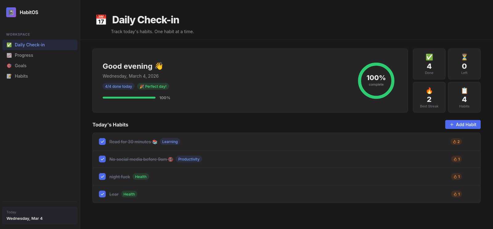
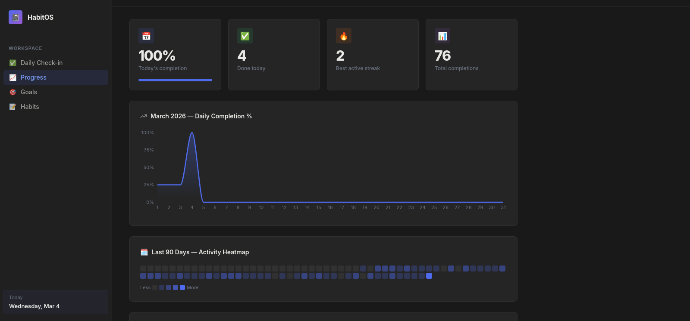
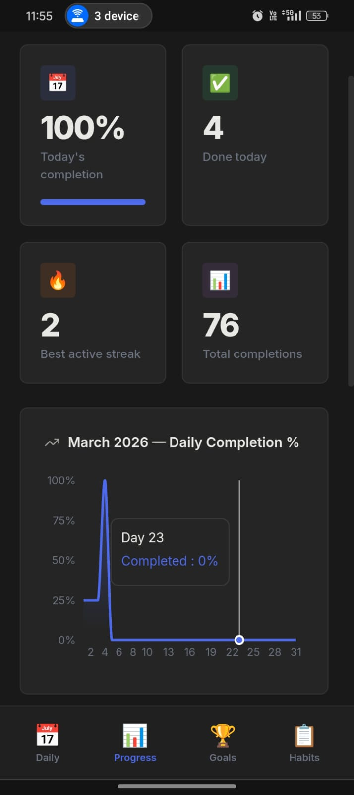
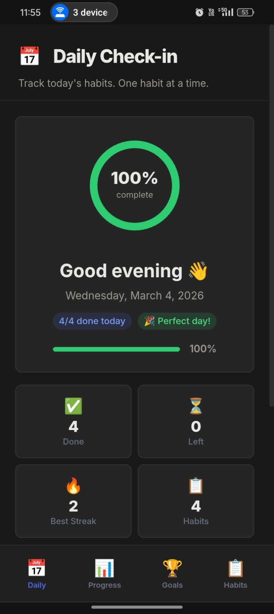

<div align="center">
  
  <h1>HabitOS 📝</h1>
  <p>A beautiful, Notion-inspired personal Habit & Goal Tracker built with React and Supabase.</p>

  [](https://vitejs.dev/)
  [](https://reactjs.org/)
  [](https://supabase.com/)
  [](https://vercel.com/)
</div>

---

HabitOS is a highly-polished personal dashboard designed to mimic the aesthetic and functionality of Notion. It moves away from cramped tables into a breathing, responsive environment for tracking daily habits, long-term goals, and visual progress.

## 📸 Screenshots

### Desktop Views

<br/><br/>


### Mobile Views
| Mobile View 1 | Mobile View 2 |
| :---: | :---: |
|  |  |

---

## ✨ Features

* **Daily Check-in:** Tick off habits with satisfying bounce animations. A dynamic SVG ring calculates your daily completion percentage.
* **Progress Dashboard:** A beautiful monthly area chart tracks your day-over-day completion rates alongside a GitHub-style 90-day heatmap block.
* **Habit Library:** Full CRUD management for habits with color-coded tags (Health, Fitness, Productivity) and auto-calculated total completions and active streak counts 🔥.
* **Long-Term Goals:** Track overarching milestones with custom hex colors and inline `+ / -` progress incrementing.
* **Global Password Lock:** The app is protected by a lightweight PIN lock screen that persists via `localStorage`, so your personal data remains private when sharing the link or leaving your device open. 
* **Brute-Force Deterrent:** Includes an IP/Device lockout mechanism that blocks access for a configurable number of hours if a user repeatedly enters the wrong password.
* **Fully Responsive:** Features a persistent left sidebar on desktop that seamlessly collapses into a sticky, app-like bottom navigation bar on mobile phones. On mobile, data tables transform into beautiful stacked cards.

---

## 🚀 How to Set This Up for Yourself

This app is designed to be forked and hosted personally. Follow these steps to get your own instance running for free.

### Step 1: Set up Supabase (Database)
1. Create a free account and new project at [Supabase](https://supabase.com/).
2. Go to the **SQL Editor** in your Supabase dashboard.
3. Paste and run the following full schema to create the necessary tables:

```sql
-- 1. Create the tables
CREATE TABLE habits (
    id UUID DEFAULT gen_random_uuid() PRIMARY KEY,
    title TEXT NOT NULL,
    category TEXT DEFAULT 'Other',
    frequency TEXT DEFAULT 'Daily',
    created_at TIMESTAMP WITH TIME ZONE DEFAULT NOW()
);

CREATE TABLE habit_logs (
    id UUID DEFAULT gen_random_uuid() PRIMARY KEY,
    habit_id UUID REFERENCES habits(id) ON DELETE CASCADE,
    date DATE NOT NULL,
    completed BOOLEAN DEFAULT false,
    created_at TIMESTAMP WITH TIME ZONE DEFAULT NOW(),
    UNIQUE(habit_id, date)
);

CREATE TABLE goals (
    id UUID DEFAULT gen_random_uuid() PRIMARY KEY,
    title TEXT NOT NULL,
    target NUMERIC NOT NULL,
    current NUMERIC DEFAULT 0,
    unit TEXT DEFAULT '',
    color TEXT DEFAULT '#3b82f6',
    created_at TIMESTAMP WITH TIME ZONE DEFAULT NOW()
);

-- 2. Add the note columns (optional but recommended)
ALTER TABLE habits ADD COLUMN IF NOT EXISTS note TEXT DEFAULT '';
ALTER TABLE goals  ADD COLUMN IF NOT EXISTS note TEXT DEFAULT '';

-- 3. Set up Row Level Security (Required by Supabase)
ALTER TABLE habits ENABLE ROW LEVEL SECURITY;
ALTER TABLE habit_logs ENABLE ROW LEVEL SECURITY;
ALTER TABLE goals ENABLE ROW LEVEL SECURITY;

-- 4. Create wide-open policies for this personal app
CREATE POLICY "Enable all for all users" ON habits FOR ALL USING (true) WITH CHECK (true);
CREATE POLICY "Enable all for all users" ON habit_logs FOR ALL USING (true) WITH CHECK (true);
CREATE POLICY "Enable all for all users" ON goals FOR ALL USING (true) WITH CHECK (true);
```
4. Go to **Project Settings > API** and copy your `Project URL` and `anon public key`.

### Step 2: Fork & Configure
1. Fork this repository to your own GitHub account.
2. If running locally, clone it and create a `.env` file in the root directory. You can set your own custom password and lockout rules here:
   ```env
   # Database keys
   VITE_SUPABASE_URL=your_supabase_project_url
   VITE_SUPABASE_ANON_KEY=your_supabase_anon_key
   
   # Security
   VITE_APP_PASSWORD=MySecretPassword123
   VITE_MAX_ATTEMPTS=5
   VITE_BLOCK_HOURS=5
   ```
3. Run `npm install` and `npm run dev` to test it locally at `http://localhost:5173`.
4. *Important Note on Security:* The app uses a simple client-side layer of protection with the `VITE_APP_PASSWORD`. If an attacker guesses incorrectly 5 times (or your custom `VITE_MAX_ATTEMPTS` variable), their browser will be blocked for 5 hours.

### Step 3: Deploy to Vercel (Free Hosting)
1. Create a free account at [Vercel](https://vercel.com/) and log in with your GitHub.
2. Click **Add New > Project** and select your newly forked `habit_tracking` repository.
3. Open the **Environment Variables** section before deploying.
4. Add *ALL* the variables from Step 2:
   - Name: `VITE_SUPABASE_URL` | Value: *(Your URL)*
   - Name: `VITE_SUPABASE_ANON_KEY` | Value: *(Your Key)*
   - Name: `VITE_APP_PASSWORD` | Value: `YourSecurePassword`
   - Name: `VITE_MAX_ATTEMPTS` | Value: `5`
   - Name: `VITE_BLOCK_HOURS` | Value: `5`
5. Click **Deploy**. Vercel will automatically build the React Vite app and give you a live HTTPS link! 

You can now save this link to your phone's home screen for quick daily access.

---

## 🛠️ Technology Stack
* Frontend Framework: React 18 + Vite
* Database & API: Supabase (PostgreSQL)
* Styling: Custom Vanilla CSS (Notion Theme Variables)
* Charts: Recharts
* Deployment: Vercel
